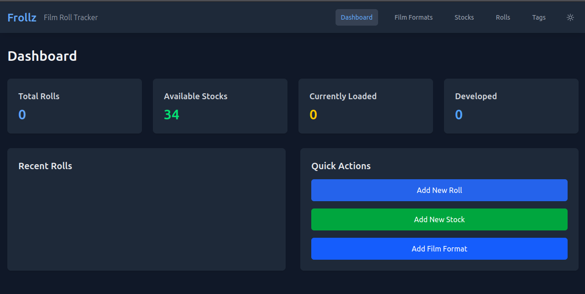
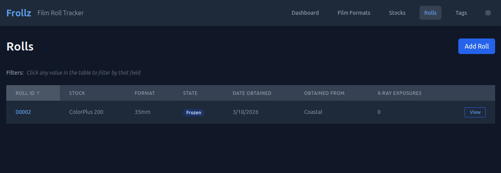
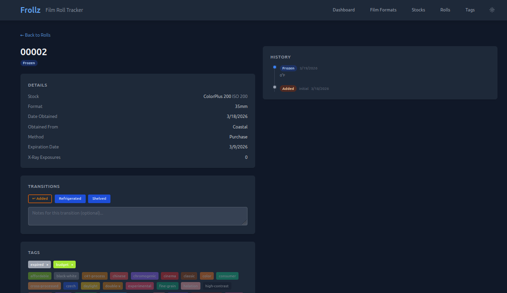
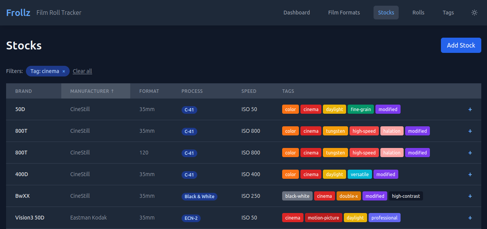
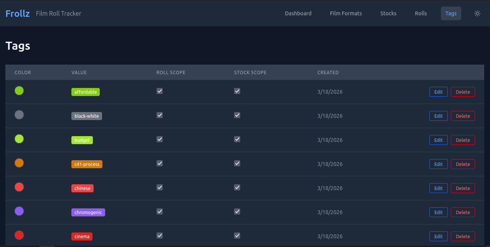

# Frollz

Frollz is a self-hosted film photography tracking application. If you shoot on film and want a personal logbook for your rolls — where they are, what stock you used, when they were shot and developed, and what came back from the lab — Frollz is built for that.

## What it does

- **Track every roll** from purchase to receiving negatives back from the lab, with a full state history
- **Catalog your film stocks** with manufacturer, process, speed, format, and tags
- **Record transition details** — storage temperatures, shot ISO, lab name, push/pull stops, scan links, and more
- **Auto-tag rolls** with `expired`, `pushed`, `pulled`, and `cross-processed` based on the data you enter
- **Correct mistakes** — backward transitions are supported and flagged as corrections in the roll's history

## Screenshots

| | |
|---|---|
|  |  |
|  |  |
|  | |

## Self-hosting

#### Film Formats
- Form Factor: Roll, Sheet, Instant, Bulk (100ft/400ft)
- Format: 35mm, 110, 120, 220, 4x5, 8x10, Instant formats

#### Stocks
- Process: ECN-2, E-6, C-41, Black & White
- Manufacturer and brand information
- ISO speed rating
- Tagging system for categorization
- Box image URL for visual reference

#### Rolls
- Unique roll identification
- Full lifecycle state machine with forward and backward transitions
- Acquisition tracking (date, method, source)
- X-ray exposure tracking
- Image album integration
- Tag system for roll-level categorization
- Per-roll transition history with direction annotation

## Roll Lifecycle

Film rolls progress through a defined lifecycle. Photographers can move rolls forward as they advance through the process, or backward to correct mistakes (marked as corrections in history).

### State Transition Table

| From State | Forward Transitions | Backward Transitions |
|---|---|---|
| **Added** | Frozen, Refrigerated, Shelved | — |
| **Frozen** | Refrigerated, Shelved | Added |
| **Refrigerated** | Shelved | Frozen, Added |
| **Shelved** | Loaded | Refrigerated, Frozen |
| **Loaded** | Finished | Shelved, Refrigerated, Frozen |
| **Finished** | Sent For Development | Loaded |
| **Sent For Development** | Developed | Finished |
| **Developed** | Received | Sent For Development |
| **Received** | — | Developed |

### State Descriptions

- **Added** — Roll has been acquired and logged in the system.
- **Frozen** — Roll is being stored in a freezer for long-term preservation.
- **Refrigerated** — Roll is in refrigerated storage (warmer than frozen; typical pre-shoot conditioning).
- **Shelved** — Roll is at room temperature and ready to be loaded into a camera.
- **Loaded** — Roll is currently in a camera being exposed.
- **Finished** — Roll has been fully exposed and removed from the camera.
- **Sent For Development** — Roll has been sent to a lab for chemical development.
- **Developed** — Lab has developed the roll.
- **Received** — Photographer has received negatives (and optionally scans) back from the lab.

### Backward Transitions

Backward transitions are allowed to correct mistakes (e.g., realizing a roll wasn't fully shot before marking it Finished). These are visually distinguished in the UI with an ↩ indicator and logged as corrections in the roll's history.

## Quick Start

### Prerequisites

- Docker with the Compose plugin (`docker compose`)
- A reverse proxy for HTTPS (Nginx Proxy Manager, Traefik, or Caddy are all good options)

### Setup

**1. Clone the repository**

```bash
git clone https://github.com/joshholl/frollz.git
cd frollz
```

**2. Create your environment file**

```bash
cp .env.example .env
```

Open `.env` and set values for `DATABASE_NAME`, `DATABASE_USER`, and `DATABASE_PASSWORD`. The defaults in `.env.example` work for a local test but **change the password** before exposing the instance to the internet.

**3. Start the stack**

### Stocks
- `GET /api/stocks` - List all stocks
- `POST /api/stocks` - Create new stock
- `GET /api/stocks/:key` - Get specific stock
- `PATCH /api/stocks/:key` - Update stock
- `DELETE /api/stocks/:key` - Delete stock

### Rolls
- `GET /api/rolls` - List all rolls
- `POST /api/rolls` - Create new roll
- `GET /api/rolls/:key` - Get specific roll
- `PATCH /api/rolls/:key` - Update roll
- `DELETE /api/rolls/:key` - Delete roll
- `POST /api/rolls/:key/transition` - Transition roll to a new state

### Roll Tags
- `GET /api/roll-tags` - List roll tags (filterable by `?rollKey=` or `?tagKey=`)
- `POST /api/roll-tags` - Assign a tag to a roll
- `DELETE /api/roll-tags/:key` - Remove a tag from a roll

## Database

The application uses PostgreSQL 18 as its primary database. Tables are automatically created on startup via DDL:

- `film_formats` - Film format specifications
- `stocks` - Film stock catalog
- `rolls` - Individual roll tracking
- `roll_states` - Roll state change history
- `tags` - Reusable tags (roll-scoped and/or stock-scoped)
- `stock_tags` - Stock ↔ tag assignments
- `roll_tags` - Roll ↔ tag assignments

## Environment Variables

### Backend (frollz-api)
```env
NODE_ENV=development
POSTGRES_HOST=postgres
POSTGRES_PORT=5432
POSTGRES_DATABASE=frollz
POSTGRES_USER=frollz
POSTGRES_PASSWORD=frollz
PORT=3000
```

The application starts on port **3000**. Point your reverse proxy at it and configure HTTPS.

**4. Access Frollz**

Once running, open your browser to the address you've configured. On first start, the database schema is created and default film stocks, formats, and tags are imported automatically.

### Updating

```bash
docker compose pull
docker compose up -d
```

Database migrations run automatically on startup — no manual steps needed.

### Configuration

| Variable | Default | Description |
|---|---|---|
| `DATABASE_HOST` | `postgres` | PostgreSQL hostname (matches the Compose service name) |
| `DATABASE_PORT` | `5432` | PostgreSQL port |
| `DATABASE_NAME` | — | Database name |
| `DATABASE_USER` | — | Database user |
| `DATABASE_PASSWORD` | — | Database password |
| `PORT` | `3000` | Port the application listens on |

## Documentation

- [Architecture & technical overview](docs/adr/architecture.md)
- [Entity relationship diagram](docs/entity-relationship.md)
- [API reference](docs/api-reference.md)
- [Release checklist](docs/release-checklist.md)

## Contributing

1. Fork the repository
2. Create a feature branch from `development`
3. Make your changes with tests
4. Submit a pull request against `development`

## License

MIT
